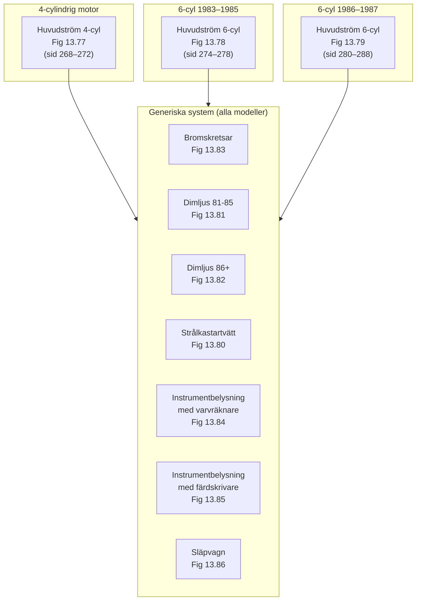

# VW LT Kopplingsscheman – Kapitel 13 Supplement

**Källa:** Volkswagen LT Workshop Manual 1976–1987, sid 265–297

---

## Figurmappning – Manualbild till Mermaid-fil

| Figur | Sida | Mermaid-fil | Beskrivning |
|-------|------|-------------|-------------|
| 10.34 | 154-155 | `01_power_distribution.mermaid` | Strömförsörjning, alla skenor |
| 10.34 | 154-155 | `02_lighting_circuit.mermaid` | Belysning (spår 15-36) |
| 10.34 | 154-155 | `04_turn_signals.mermaid` | Blinkers (spår 38-47) |
| 10.34 | 154-155 | `05_instruments.mermaid` | Instrument (spår 59-66) |
| 10.34 | 154-155 | `09_supplementary.mermaid` | Fläkt, bakruta, tuta (spår 1-2, 48-54, 69-70) |
| 10.34 | 154-155 | `11_starter_circuit.mermaid` | Starter/laddning (spår 2-8) |
| 10.34 | 154-155 | `12_fuel_pump.mermaid` | Bränslepump (spår 72) |
| 10.34 | 154-155 | `15_charging_circuit.mermaid` | Laddningskrets (spår 2-3) |
| 13.80 | 289 | `03_wiper_washer.mermaid` | Torkare/spolare/strålk.tvätt |
| 13.81 | 290 | `06_foglight.mermaid` | Dimljus 1981-1985 |
| 13.82 | 291 | `06_foglight.mermaid` | Dimljus 1986+ (samma diagram) |
| 13.83 | 292 | `08_brake_circuit.mermaid` | Dubbelkretsbromsar |
| 13.84 | 293 | `13_dash_lights_rev_counter.mermaid` | Instrumentbelysning m varvräknare |
| 13.85 | 294 | `14_dash_lights_clock_tacho.mermaid` | Instrumentbelysning m färdskrivare |
| 13.86 | 295 | `07_trailer_towing.mermaid` | Släpvagnsdragning |
| – | – | `00_system_overview.mermaid` | Systemöversikt (alla kretsar) |
| – | – | `10_gnd_triggered.mermaid` | Konceptdiagram: jordkopplade kretsar |

---

## Innehållsförteckning

### Generiska diagram (alla modeller)

Dessa supplementära diagram gäller oavsett motorvariant (4-cyl eller 6-cyl):

| Fil | Figur | Beskrivning | Årtal |
|-----|-------|-------------|-------|
| `Fig_13_80_Headlight_Washers.md` | 13.80 | Strålkastartvätt | 1980 on |
| `Fig_13_81_Foglights_1981_1985.md` | 13.81 | Dimljus fram/bak | 1981–1985 |
| `Fig_13_82_Foglights_1986_on.md` | 13.82 | Dimljus fram/bak | 1986 on |
| `Fig_13_83_Dual_Circuit_Brakes.md` | 13.83 | Dubbelkretsbromsar & handbromsvarning | 1980 on |
| `Fig_13_84_Dash_Lights_Rev_Counter.md` | 13.84 | Instrumentbelysning med varvräknare | 1985 on |
| `Fig_13_85_Dash_Lights_Clock_Tachograph.md` | 13.85 | Instrumentbelysning med klocka/färdskrivare | 1985 on |
| `Fig_13_86_Trailer_Towing.md` | 13.86 | Släpvagnsdragning | 1983–1985 |
| `Chapter_13_Supplement_Radio_Interference.md` | – | Radiostörningar & motåtgärder | Alla |
| `Keys_Supplementary_Diagrams.md` | – | Nycklar till Fig 13.80–13.85 | Alla |

### Motorspecifika diagram

| Fil | Figur | Beskrivning | Motor | Årtal |
|-----|-------|-------------|-------|-------|
| `Key_Fig_13_77_4cyl.md` | 13.77 | Huvudströmflöde (nyckel + översikt) | 4-cyl | 1981 on |
| `Key_Fig_13_78_6cyl_1983_1985.md` | 13.78 | Huvudströmflöde (nyckel + översikt) | 6-cyl | 1983–1985 |
| `Key_Fig_13_79_6cyl_1986_1987.md` | 13.79 | Huvudströmflöde (nyckel + översikt) | 6-cyl | 1986–1987 |

---

## Övergripande systemöversikt

## Färgkod (Colour Code)

Gemensam för alla diagram:

| Kod | Färg (DE) | Färg (SV) | Färg (EN) |
|-----|-----------|-----------|-----------|
| sw | Schwarz | Svart | Black |
| ws | Weiß | Vit | White |
| be/bl | Blau | Blå | Blue |
| ro | Rot | Röd | Red |
| gn | Grün | Grön | Green |
| ge | Gelb | Gul | Yellow |
| br | Braun | Brun | Brown |
| gr | Grau | Grå | Grey |
| li | Lila | Lila | Lilac |
| pi | Pink | Rosa | Pink |

### Kabelbeteckningar

Kablar anges som `färg1/färg2 tvärsnittsarea`, t.ex.:
- `sw/ws 1.0` = svart med vit rand, 1.0 mm²
- `ro/ge 0.5` = röd med gul rand, 0.5 mm²

Den första färgen är grundfärgen, den andra är randfärgen.

## Matningsskenor

Alla diagram använder fyra gemensamma matningsskenor:

| Skena | Funktion |
|-------|----------|
| **30** | Batteri+ (alltid ström) |
| **15** | Tändning på (via tändlås) |
| **X** | Tändning + startläge (via avlastningsrelä J59) |
| **31** | Jord (chassi) |
