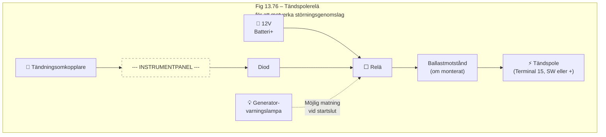

# Kapitel 13 Supplement – Radiostörningar och motåtgärder

**Källa:** VW LT Workshop Manual 1976–1987, sid 265–266

## Fjäderkontakter vid hjul (Sec 13B)

Se Fig 13.75 i manualen för illustration av fjäderkontakter vid hjulen.

## Bränslepump – Störningsdämpning

Bränslepumpen kräver en 1 mikrofarad kondensator mellan matningskabeln och en närliggande jordpunkt. Om detta inte räcker kan en 7 ampere nätstrypning behöva kopplas in nära pumpen.

## Lysrör (Fluorescent tubes)

Fordon som används för camping/husbil har ofta lysrörsbelysning. Dessa kräver hög spänning via en inverter (oscillator) som kan orsaka allvarliga störningar på radiomottagning. Åtgärder inkluderar att montera antennen så långt som möjligt från lysröret, och att skärma röret med tunn tråd lindad med 25 mm mellanrum och jordad till chassit. Lämpliga strypningar bör monteras i båda matningskablarna nära invertern.

## Radio/kassettspelare – Störningsgenomslag

Magnetisk strålning från instrumentbrädan kan tränga igenom kassettpelarens metallhölje. Detta visar sig som störningar på AM och kassettuppspelning, och/eller generator-/tändningsstörningar.

### Felsökning

1. Kontrollera att alla clips/skruvar som håller ihop kassettpelarens hölje sitter korrekt
2. Försök omdirigera den störande kabeln
3. Flytta kassettspelaren till en punkt med lägre störningsnivå
4. Om den punkten bekräftar lokal strålning, försök fixa utrustningen i det området

### Generatorstörning på kassettuppspelning

Orsakas av strålning från huvudladdningskabeln (batteri+ via startmotorrelä). Lösning: dra en ny kabel direkt från generatorns utgångsterminal till batteriet med minst 6 mm² tvärsnittsarea, kortast möjliga väg. **Kom ihåg – koppla bort generatorn från batteriet först.**

### Tändningsstörning (AM/kassett)

Svårt problem. Åtgärder:
- Linda jordad folie runt den störande kabeln
- Montera avledningsplatta jordad till chassit
- Använd relä på tändspolen (se Fig 13.76)

En lämplig diod bör användas eftersom det vid avstängning av tändningen är möjligt att generatorvarningslampans utgång håller relät tillkopplat.

## Kopplingskomponenter för störningsdämpning

Kondensatorer levereras vanligen med flikar i änden av ledaren. Kondensatorhuset har en fläns med slits eller hål för montering med mutter/skruv.

### Kabelanslutningar

Bästa sättet att ansluta kablar är med självavlöpande kontakter ("scotchlocks") som klämmer runt kabeln och skär genom isoleringen.

### Strypningar (chokes)

Strypningar levereras med snap-in kontakter och enbart bar koppartråd. Lämpliga honkontakter finns hos bileltillbehörshandlare. Notera att vid kapning av kabeln för strypningsmontering behövs eventuellt extra kontakter. För strypningar med bar tråd kan liknande kontakter pressas ihop med isoleringsslang efter behov.

## VHF/FM-mottagning

VHF/FM-mottagning i fordon är mer störningskänslig än medel- och långvåg. VHF-sändare är begränsade till siktlinje, med räckvidd 10–50 miles beroende på terräng, byggnader och sändareffekt.

### Rekommendationer för VHF/FM-installation

1. **Jordning** av mottagarchassit och antennfästet är viktigt. Använd separat jordkabel vid radion och skrapa bort färg vid antennfästet
2. Använd kvalitetsantenn på taket, så högt som möjligt och långt från störande utrustning
3. Använd kvalitetsnedledning – billiga kablar ger betydande förluster
4. FM-sändningar kan vara horisontella, cirkulära eller lutande. Optimalt monteringsläge är 45° mot fordonstak

## CB-radio (Citizens' Band)

I Storbritannien arbetar CB-sändare/mottagare inom 27 MHz och 934 MHz FM-band. Maximal sändningseffekt är 4 watt med 40 kanaler, 10 kHz mellanrum, inom 27.60125–27.99125 MHz.

### Antennkrav

Regler begränsar antennlängden till 1,65 meter inklusive belastningsspole. Korrekt avstämning är nödvändig.

### Störningsproblem med CB

1. **Störning till närliggande TV/radio** vid sändning
2. **Störning till CB** från fordonets elutrustning

Brittiska fordonsstillverkare tillhandahåller störningsdämpning 40–250 MHz för TV- och VHF-skydd. Vid 27 MHz är denna dämpning generellt tillräcklig, men individuella komponenter (generatorer, klockor, stabilisatorer, blinkers, torkarmotorer etc.) kan behöva ytterligare dämpning.

## Övriga fordonsradiosändare

Utöver CB har användningen av kombinerade sändare/mottagare ökat kraftigt. Samma störningsdämpningstekniker gäller, men tyngre strypningar krävs i matningskablarna eftersom belastningen vid sändning är relativt hög.
