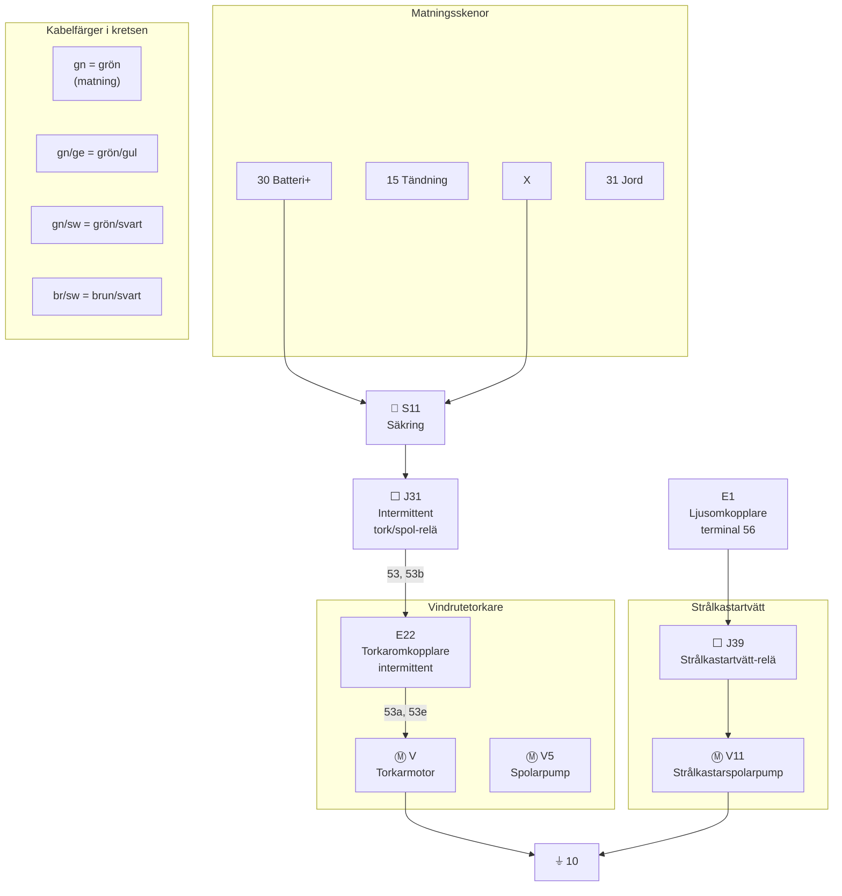

# Fig 13.80 – Strålkastartvätt (Headlight Washers), 1980 on

**Källa:** VW LT Workshop Manual 1976–1987, sid 289

## Colour Code

| Kod | Färg | Kod | Färg |
|-----|------|-----|------|
| br | Brown | gr | Grey |
| ge | Yellow | ro | Red |
| gn | Green | sw | Black |
| ws | White | | |

## Komponentförteckning (Key to Fig 13.80)

| Bet. | Beskrivning | Strömspår |
|------|-------------|-----------|
| E1 | Ljusomkopplare, terminal 56 | 10 |
| E22 | Torkaromkopplare, intermittent | 4–8 |
| J31 | Intermittent tork/spol-relä | 3–6 |
| J39 | Strålkastartvätt-relä | 11–13 |
| S11 | Säkring i säkringsdosa | |
| T1a | Koppling, enkel, bakom instrumentbräda | |
| T1b | Koppling, enkel, bakom instrumentbräda | |
| T2 | Koppling, 2-pin, nära vindrutespolarpump | |
| V | Vindrutetorkarmotor | 1–3 |
| V5 | Vindrutespolarpump | 9 |
| V11 | Strålkastarspolarpump | 13 |

| Jord | Plats |
|------|-------|
| 9 | På säkringsdosa |
| 10 | Bakom instrumentbräda, nära säkringsdosa |

## Kretsschema

## Funktionsbeskrivning

Strålkastartvätten aktiveras genom relä **J39** som styrs av ljusomkopplaren **E1**. Spolarpumpen **V11** matas via säkring **S11** och jordas vid punkt 10 bakom instrumentbrädan. Vindrutetorkaren **V** styrs via **E22** (intermittent) och **J31** (relä).
