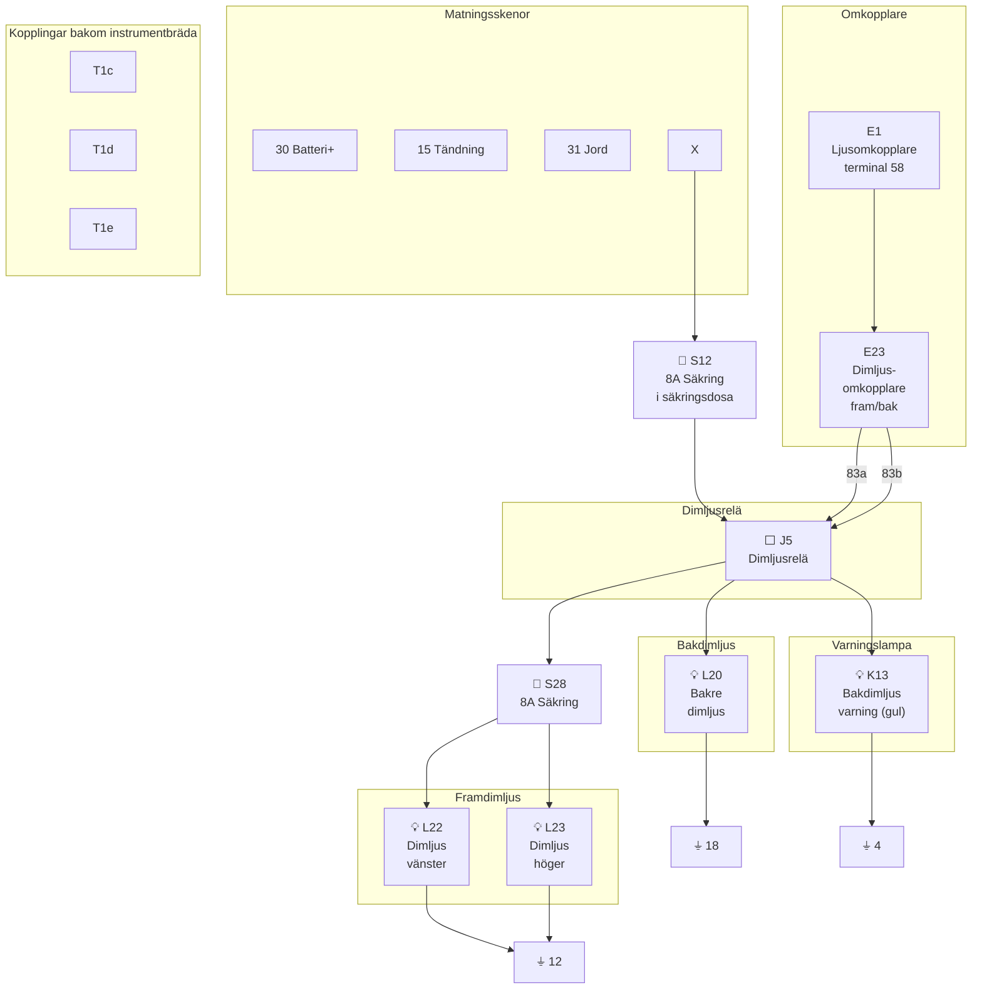

# Fig 13.81 – Dimljus fram och bak (Front and Rear Foglights), 1981–1985

**Källa:** VW LT Workshop Manual 1976–1987, sid 290

## Colour Code

| Kod | Färg | Kod | Färg |
|-----|------|-----|------|
| br | Brown | li | Lilac |
| ge | Yellow | ro | Red |
| gr | Grey | sw | Black |
| ws | White | | |

## Komponentförteckning (Key to Fig 13.81)

| Bet. | Beskrivning | Strömspår |
|------|-------------|-----------|
| E1 | Ljusomkopplare, terminal 58 | 1 |
| E23 | Dimljusomkopplare (fram och bak) | 5–8 |
| J5 | Dimljusrelä | 3–5 |
| K13 | Bakdimljus varningslampa (gul) | 4 |
| L20 | Bakre dimljusglödlampa | 6 |
| L22 | Dimljusglödlampa vänster | 8 |
| L23 | Dimljusglödlampa höger | 9 |
| S12 | Säkring i säkringsdosa | |
| S28 | Säkring för dimljus (8 Amp.) | 7 |
| T1 | Koppling, enkel, bakom instrumentbräda | |
| T1a | Koppling, enkel, bakom luftventil | |
| T1b | Koppling, enkel, bakom luftventil | |
| T1c | Koppling, enkel, bakom tvärpanel | |
| T1d | Koppling, enkel, bakom instrumentbräda | |
| T1e | Koppling, enkel, bakom tvärpanel | |
| X | Nummerskyltsljus | 2 |

| Jord | Plats |
|------|-------|
| 4 | På instrumentpanelinsats |
| 5 | På tvärpanel/sidolem |
| 10 | Bakom instrumentbräda, vänster |
| 11 | Bakom instrumentbräda, höger |

## Kretsschema

## Funktionsbeskrivning

Dimljusen styrs av relä **J5** som aktiveras genom dimljusomkopplaren **E23** (kombinerad fram/bak). Ljusomkopplaren **E1** (terminal 58) måste vara på för att dimljusen ska kunna aktiveras. Framre dimljusen **L22** och **L23** skyddas av separat säkring **S28** (8A). Bakre dimljuslampan **L20** har en tillhörande varningslampa **K13** (gul) i instrumentpanelen.
