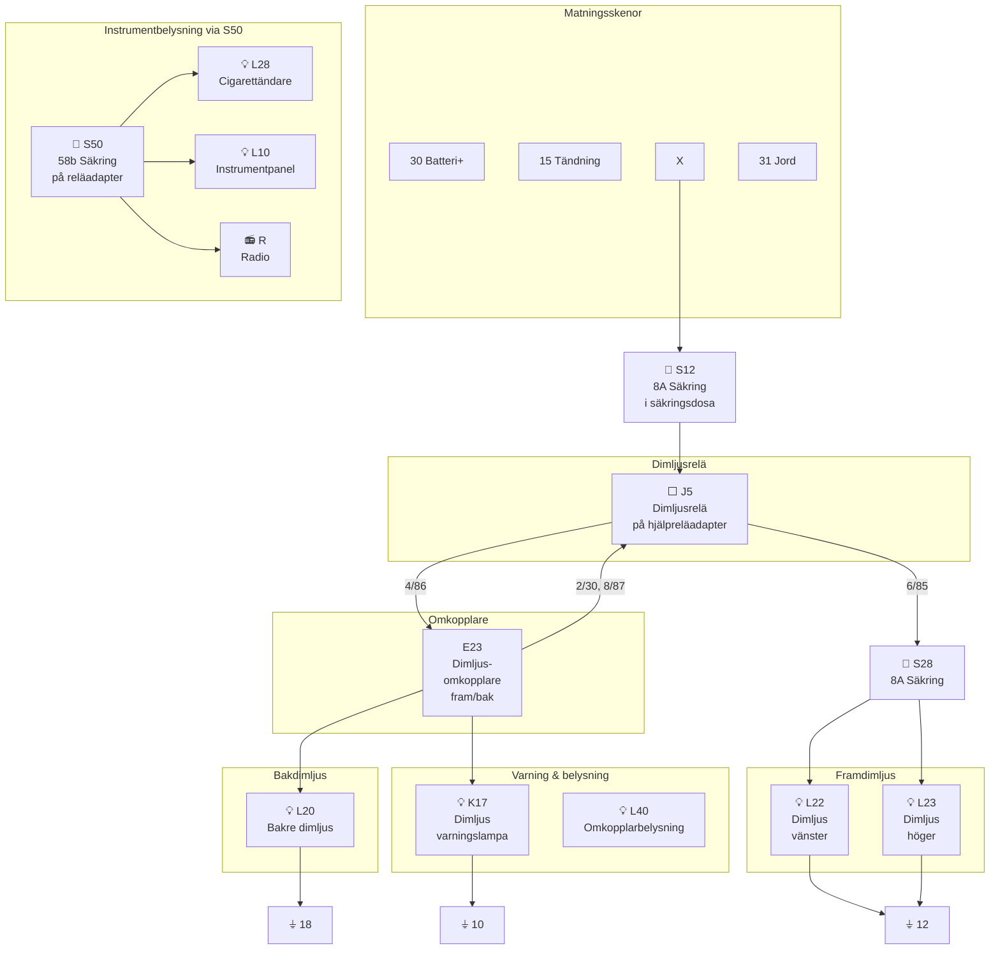

# Fig 13.82 – Dimljus fram och bak (Front and Rear Foglights), 1986 on

**Källa:** VW LT Workshop Manual 1976–1987, sid 291

## Colour Code

| Kod | Färg | Kod | Färg |
|-----|------|-----|------|
| bl | Blue | li | Lilac |
| br | Brown | ro | Red |
| ge | Yellow | sw | Black |
| gn | Green | ws | White |
| gr | Grey | | |

## Komponentförteckning (Key to Fig 13.82)

| Bet. | Beskrivning | Strömspår |
|------|-------------|-----------|
| E1 | Ljusomkopplare | 4 |
| E23 | Dimljusomkopplare (fram och bak) | 2–5 |
| J5 | Dimljusrelä på hjälpreläadapter | 1–3 |
| K17 | Dimljus varningslampa | 4, 5 |
| L10 | Instrumentpanelinsats ljusglödlampa | 8 |
| L20 | Bakre dimljusglödlampa | 4 |
| L22 | Dimljusglödlampa vänster | 2 |
| L23 | Dimljusglödlampa höger | 3 |
| L28 | Cigarettändare ljusglödlampa | 7 |
| L40 | Dimljusomkopplare ljusglödlampa | 5 |
| R | Radio | 6 |
| S12 | Säkring i säkringsdosa (8A) | |
| S28 | Separat säkring för dimljus | 3 |
| S50 | Säkring, terminal 58b, på hjälpreläadapter | 7 |
| T1c | Koppling, enkel, bakom instrumentbräda | |
| T1d | Koppling, enkel, bakom luftventiltrim | |
| T1e | Koppling, enkel, bakom luftventiltrim | |
| T1f | Koppling, enkel, bakom instrumentbräda | |
| T1g | Koppling, enkel, bakom bakre skärm | |
| T1h | Koppling, enkel, bakom bakre skärm | |
| T2a | Koppling, 2-pin, bakom instrumentbräda | |
| T2d | Koppling, 2-pin, bakom instrumentbräda | |
| T4a | Koppling, 4-pin, bakom instrumentbräda | |

| Jord | Plats |
|------|-------|
| 10 | Instrumentpanelinsats |
| 11 | Bakom instrumentbräda, höger |
| 12 | Intill reläplatta |
| 18 | Bakre tvärbalk |

## Kretsschema

## Funktionsbeskrivning

1986+ versionen använder dimljusrelä **J5** monterat på en hjälpreläadapter. Dimljusomkopplaren **E23** aktiverar relät via kontakt 4/86 och 8/87. Framdimljusen **L22/L23** skyddas av separat säkring **S28** (8A). En varningslampa **K17** indikerar att bakdimljuset **L20** är aktivt. Instrumentbelysningen (L10, L28, Radio R) går via säkring **S50** på terminal 58b.
