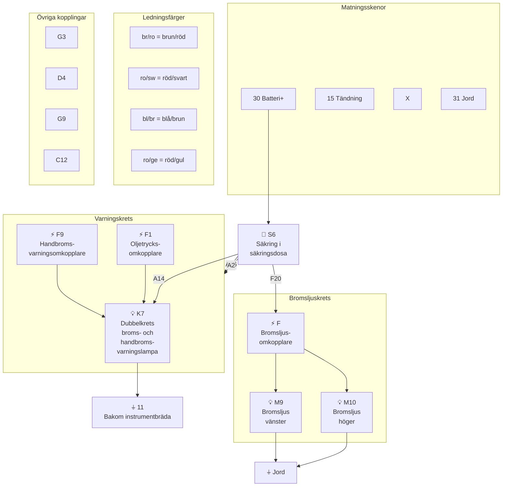

# Fig 13.83 – Dubbelkretsbromsar och handbromsvarningslampa, 1980 on

**Källa:** VW LT Workshop Manual 1976–1987, sid 292

## Colour Code

| Kod | Färg | Kod | Färg |
|-----|------|-----|------|
| bl | Blue | ro | Red |
| br | Brown | sw | Black |
| ge | Yellow | | |
| gn | Green | | |

## Komponentförteckning (Key to Fig 13.83)

| Bet. | Beskrivning | Strömspår |
|------|-------------|-----------|
| F | Bromsljusomkopplare | 2–4 |
| F1 | Oljetrycksomkopplare | 8 |
| F9 | Handbromsvarningsomkopplare | 6 |
| K7 | Dubbelkrets broms- och handbromsvarningslampa | 5–7 |
| M9 | Bromsljus vänster | 1 |
| M10 | Bromsljus höger | 2 |
| S6 | Säkring i säkringsdosa | |
| T1 | Koppling, enkel | |

| Jord | Plats |
|------|-------|
| 11 | Jordpunkt bakom instrumentbräda |

## Kretsschema

## Funktionsbeskrivning

Bromsljusen **M9** (vänster) och **M10** (höger) aktiveras av bromsljusomkopplaren **F** som matas via säkring **S6**. Varningslampan **K7** visar dubbelkretsbromsfel och handbroms. Den aktiveras antingen av handbromsvarningsomkopplaren **F9** (när handbromsen är dragen) eller av oljetrycksomkopplaren **F1** (vid bromsvätskefel). Jordpunkt 11 sitter bakom instrumentbrädan.
