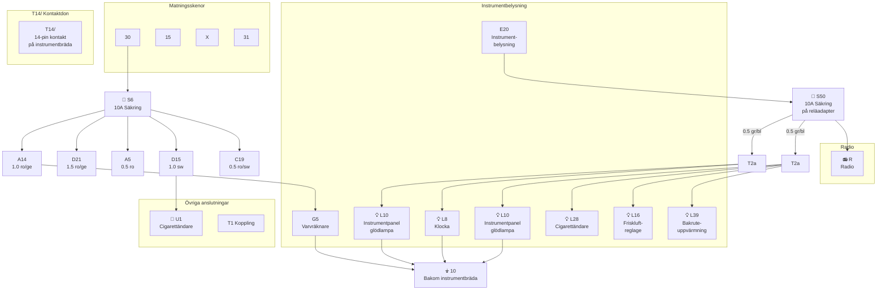

# Fig 13.84 – Säkring instrumentbelysning med varvräknare, 1985 on

**Källa:** VW LT Workshop Manual 1976–1987, sid 293

## Colour Code

| Kod | Färg | Kod | Färg |
|-----|------|-----|------|
| bl | Blue | gr | Grey |
| br | Brown | ro | Red |
| ge | Yellow | sw | Black |
| gn | Green | ws | White |

## Komponentförteckning (Key to Fig 13.84)

| Bet. | Beskrivning | Strömspår |
|------|-------------|-----------|
| C | Alternator (enbart diesel) | 6 |
| D | Tändning/startomkopplare | 6 |
| E3 | Nödljusomkopplare | 2, 12 |
| E20 | Instrument/instrumentpanelbelysning | 11 |
| F | Bromsljusomkopplare | 1 |
| G5 | Varvräknare | 5 |
| L8 | Klockglödlampa | 7 |
| L10 | Instrumentpanelinsats glödlampa | 8–11 |
| L16 | Friskluftreglage glödlampa | 13 |
| L28 | Cigarettändare glödlampa | 11 |
| L39 | Bakruteuppvärmning omkopplarglödlampa | 14 |
| N | Tändspole (enbart bensinmotor) | 7 |
| R | Radioanslutning | 4, 10 |
| S6 | Säkring i säkringsdosa | |
| S50 | Säkring på reläadapter | |
| T1 | Koppling, enkel, bakom instrumentbräda | |
| T1a | Koppling, enkel, bakom instrumentbräda | |
| T1b | Koppling, enkel, bakom instrumentbräda | |
| T1c | Koppling, enkel, bakom instrumentbräda | |
| T2a | Koppling, 2-pin, bakom instrumentbräda | |
| T2b | Koppling, 2-pin, bakom instrumentbräda | |
| T14/ | Koppling, 14-pin, bakom instrumentbräda | |
| U1 | Cigarettändare | 3 |

| Jord | Plats |
|------|-------|
| 10 | Jordpunkt bakom instrumentbräda |

## Kretsschema

## Funktionsbeskrivning

Instrumentbelysningen på 1985+ modeller med varvräknare matas via säkring **S6** (10A). Huvudbelysningsreglaget **E20** styr belysningsnivån till instrumentpanelen. Säkring **S50** på reläadaptern skyddar instrumentglödlamporna **L10**, klockbelysningen **L8**, cigarettändarbelysningen **L28** och friskluftreglagebelysningen **L16**. Alla jordas vid punkt 10 bakom instrumentbrädan. Varvräknaren **G5** ansluts via A14 (röd/gul kabel, 1.0 mm²).
