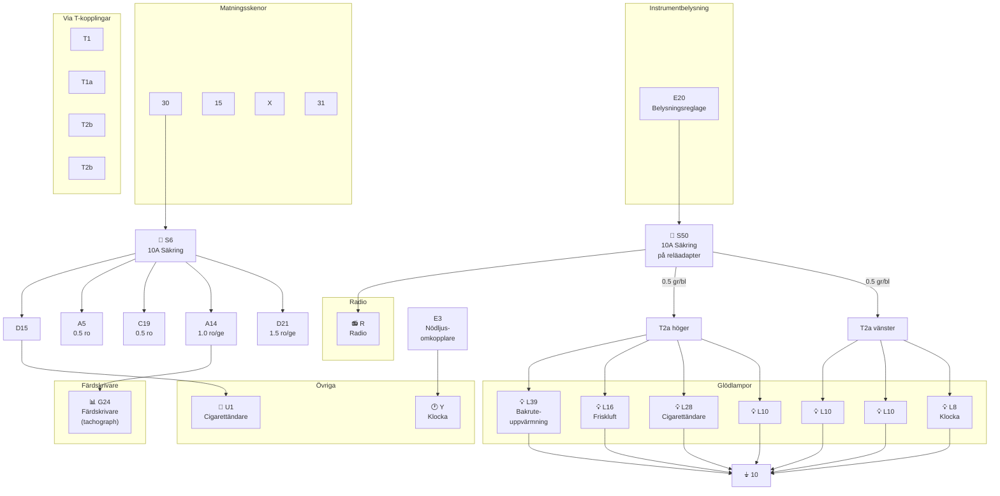

# Fig 13.85 – Säkring instrumentbelysning med klocka och färdskrivare, 1985 on

**Källa:** VW LT Workshop Manual 1976–1987, sid 294

## Colour Code

| Kod | Färg | Kod | Färg |
|-----|------|-----|------|
| bl | Blue | gr | Grey |
| br | Brown | ro | Red |
| ge | Yellow | sw | Black |
| gn | Green | ws | White |

## Komponentförteckning (Key to Fig 13.85)

| Bet. | Beskrivning | Strömspår |
|------|-------------|-----------|
| E3 | Nödljusomkopplare | 1, 12 |
| E20 | Instrument/instrumentpanelbelysning | 7 |
| F | Bromsljusomkopplare | 5 |
| G24 | Färdskrivare (tachograph) | 4–6 |
| L8 | Klockglödlampa | 9 |
| L10 | Instrumentpanelinsats glödlampa | 10–13 |
| L16 | Friskluftreglage glödlampa | 14 |
| L28 | Cigarettändare glödlampa | 8 |
| L39 | Bakruteuppvärmning omkopplarglödlampa | 15 |
| R | Radioanslutning | 3, 7 |
| S6 | Säkring i säkringsdosa | |
| S50 | Säkring på reläadapter | |
| T1 | Koppling, enkel, bakom instrumentbräda | |
| T1a | Koppling, enkel, bakom instrumentbräda | |
| T2 | Koppling, 2-pin, bakom instrumentbräda | |
| T2a | Koppling, 2-pin, bakom instrumentbräda | |
| T2b | Koppling, 2-pin, bakom instrumentbräda | |
| T14/ | Koppling, 14-pin, bakom instrumentbräda | |
| U1 | Cigarettändare | 2 |
| Y | Klocka | 1 |

| Jord | Plats |
|------|-------|
| 10 | Jordpunkt bakom instrumentbräda |

## Kretsschema

## Funktionsbeskrivning

Denna variant gäller fordon med **färdskrivare (G24)** istället för varvräknare. Kretsen är i övrigt snarlik Fig 13.84. Färdskrivaren ansluts via A14 (röd/gul, 1.0 mm²). Klockan **Y** matas separat via nödljusomkopplaren **E3**. All instrumentbelysning går via **S50** på reläadaptern och jordas vid punkt 10.
