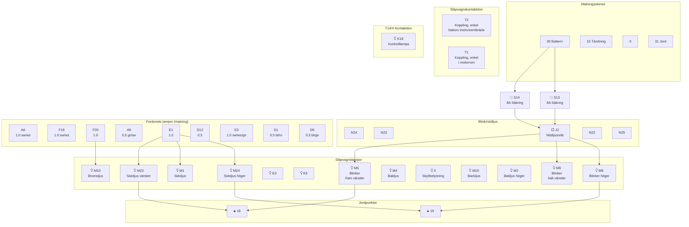

# Fig 13.86 – Släpvagnsdragning (Trailer Towing), 1983–1985

**Källa:** VW LT Workshop Manual 1976–1987, sid 295

## Colour Code

| Kod | Färg | Kod | Färg |
|-----|------|-----|------|
| bl | Blue | gr | Grey |
| br | Brown | ro | Red |
| ge | Yellow | sw | Black |
| gn | Green | | |

## Komponentförteckning

| Bet. | Beskrivning | Strömspår |
|------|-------------|-----------|
| S14 | Säkring 8A | |
| S13 | Säkring 8A | |
| N24 | | |
| N23 | | |
| J2 | Nödljusrelä | |
| N22 | | |
| N25 | | |
| E1 | Ljusomkopplare | |
| E3 | Nödljusomkopplare | |
| K5 | Blinkervarningslampa | |
| K18 | Kontrolllampa | |
| F | Bromsljusomkopplare | |
| M1 | Sidoljus vänster (släp) | |
| E1 | Ljusomkopplare | |
| E3 | Nödljusomkopplare | |
| M5 | Blinker fram vänster (släp) | |
| M6 | Blinker bak vänster (släp) | |
| M4 | Blinker bak (släp) | |
| M16 | Backljus vänster (släp) | |
| X | Nummerskyltsljus | |
| U | Släpvagnskontaktdon | |
| M23 | Sidoljus (släp) | |
| M10 | Bromsljus (släp) | |
| M2 | Bakljus höger (släp) | |
| M8 | Blinker höger (släp) | |
| M24 | Sidoljus höger (släp) | |

## Kretsschema – Släpvagnsuttag

## Funktionsbeskrivning

Släpvagnskopplingen matas via två separata 8A säkringar **S14** och **S13**. Blink- och nödljussignalerna går genom nödljusrelät **J2** och distribueras till släpvagnens blinkers. Sidoljusen styrs av ljusomkopplaren **E1**, bromsljusen av bromsljusomkopplaren **F**. Kontrolllampa **K18** indikerar släpvagnens anslutning. Jordning sker vid punkterna 18 (bakre sidolem vänster) och 19 (bakre sidolem höger).
