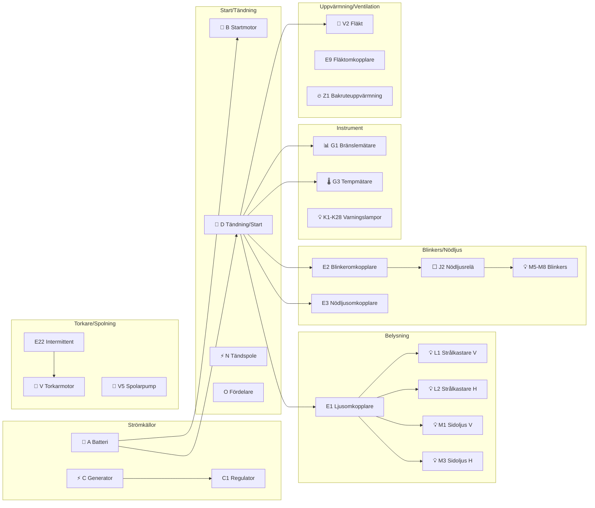

# Nyckel till Fig 13.77 – Huvudströmflödesdiagram, 4-cylinder, 1981 on

**Källa:** VW LT Workshop Manual 1976–1987, sid 267

## Komponentförteckning

| Bet. | Beskrivning | Strömspår |
|------|-------------|-----------|
| A | Batteri | 4 |
| B | Startmotor | 5, 6 |
| C | Generator | 2, 3 |
| C1 | Spänningsregulator | 2, 3 |
| D | Tändning/startomkopplare | 9–11 |
| E1 | Ljusomkopplare | 61–63 |
| E2 | Blinkeromkopplare | 44–46 |
| E3 | Nödljusomkopplare | 40–47 |
| E4 | Helljusdimmer/blinkeromkopplare | 69, 70 |
| E9 | Friskluftsfläktomkopplare | 56–58 |
| E15 | Bakruteuppvärmningsomkopplare | 36–37 |
| E20 | Instrument/instrumentpanelbelysning | 64 |
| E22 | Intermittent torkaromkopplare | 84–87 |
| F | Bromsljusomkopplare | 52 |
| F1 | Oljetrycksomkopplare | 19 |
| F2 | Dörrkontaktomkopplare, vänster fram | 82 |
| F4 | Backljusomkopplare | 27 |
| F7 | Dörrkontaktomkopplare, bakre skjutdörr | 79 |
| F9 | Handbromsvarningsomkopplare | 20 |
| F11 | Bakdörrkontaktomkopplare | 80 |
| F12 | Starthjälp varningskontakt | 38 |
| F34 | Bromsvätska nivåvarningskontakt | 17 |
| F35 | Termobrytare för insugsgrenrör förvärmning | 31 |
| F66 | Kylvätskenivå indikatoromkopplare | 23 |
| G | Bränslemätare sändare | 22 |
| G1 | Bränslemätare | 13 |
| G2 | Kylvätsketemperatur sändare | 21 |
| G3 | Kylvätsketemperaturmätare | 14 |
| G6 | Elektrisk bränslepump | 23 |
| H | Tuta reglage | 33 |
| H1 | Tuta | 30 |
| J2 | Nödljusrelä | 42, 43 |
| J6 | Spänningsstabilisator | 13 |
| J31 | Intermittent tork/spol-relä | 82, 86 |
| J59 | Avlastningsrelä (för X-kontakt) | 58, 59 |
| J81 | Insugsgrenrör förvärmningsrelä | 30, 31 |
| J120 | Kylvätska låg nivå indikator | 22, 23 |
| K1 | Helljusvarningslampa | 78 |
| K2 | Generatorvarningslampa | 16 |
| K3 | Oljetrycksvarningslampa | 18 |
| K5 | Blinkervarningslampa | 17 |
| K6 | Nödljussystem varningslampa | 47 |
| K7 | Dubbelkretsbromsar och handbroms varningslampa | 19 |
| K10 | Bakruteuppvärmning varningslampa | 37 |
| K15 | Choke varningslampa | 38 |
| K28 | Kylvätsketemperatur varningslampa (röd) | 15 |
| L1 | Dubbelfilament strålkastare, vänster | 74, 76 |
| L2 | Dubbelfilament strålkastare, höger | 75, 77 |
| L9 | Ljusomkopplare ljusglödlampa | 59 |
| L10 | Instrumentpanelinsats glödlampa | 62–64 |
| L16 | Friskluftreglage glödlampa | 65 |
| L39 | Bakruteuppvärmning omkopplarglödlampa | 38 |
| M1 | Sidoljus, vänster | 69 |
| M2 | Bakljus, höger | 70 |
| M3 | Sidoljus, höger | 71 |
| M4 | Bakljus, vänster | 68 |
| M5 | Blinker fram vänster | 48 |
| M6 | Blinker bak vänster | 49 |
| M7 | Blinker fram höger | 50 |
| M8 | Blinker bak höger | 51 |
| M9 | Bromsljus, vänster | 54 |
| M10 | Bromsljus, höger | 55 |
| M16 | Backljus, vänster | 29 |
| M17 | Backljus, höger | 30 |
| N | Tändspole | 7 |
| N1 | Automatisk choke, vänster | 32 |
| N3 | Bypass luftavstängningsventil | 33 |
| N6 | Seriemotstånd | 7 |
| N23 | Seriemotstånd för friskluftsfläkt | 56 |
| N52 | Värmemotstånd (del av gaskanal uppvärmning – förgasare) | 25 |
| N51 | Värmeelement för insugsgrenrör förvärmning | 30 |
| O | Fördelare | 7, 8 |
| P | Tändstiftskontakt | 7, 8 |
| Q | Tändstift | 7, 8 |
| S1–S15 | Säkringar i säkringsdosa | |
| T1 | Koppling, enkel, i motorrum | |
| T1b | Koppling, enkel, nära förgasare | |
| T1c | Koppling, enkel, i bakdörr | |
| T1d | Koppling, enkel, bakom instrumentpanel | |
| T1e | Koppling, enkel, bakom instrumentpanel | |
| T4 | Koppling, 4-pin, bakom instrumentpanel | |
| T12/ | Koppling, 12-pin, på instrumentpanelinsats | 84, 85 |
| V | Vindrutetorkarmotor | 81, 82 |
| V2 | Friskluftsfläkt | 57 |
| V5 | Vindrutespolarpump | 88 |
| W | Kupébelysning, fram | 80 |
| W1 | Kupébelysning, bak/lastfack (enbart skåpbil) | 66, 67 |
| X | Nummerskyltsbelysning (enbart skåpbil) | 66, 67 |
| Z1 | Bakruteuppvärmning | 34 |

## Jordpunkter

| Nr | Plats |
|----|-------|
| 1 | Batteriets jordband |
| 3 | Jordband motor till kaross |
| 10 | Jordpunkt, instrumentpanelinsats |
| 11 | Jordpunkt, bakom instrumentpanel |
| 12 | Jordpunkt, under instrumentpanel nära säkringsdosa |
| 13 | Jordpunkt, vid bakdörr |
| 14 | Jordpunkt, på taktvärbalk, passagerarsida |
| 15 | Jordpunkt, vid bakre längsgående balk |
| 17 | Jordpunkt, vid styrväxel |
| 18 | Jordpunkt, vid längsgående balk, bak vänster |
| 19 | Jordpunkt, vid längsgående balk, bak höger |

## Övergripande kretsöversikt

