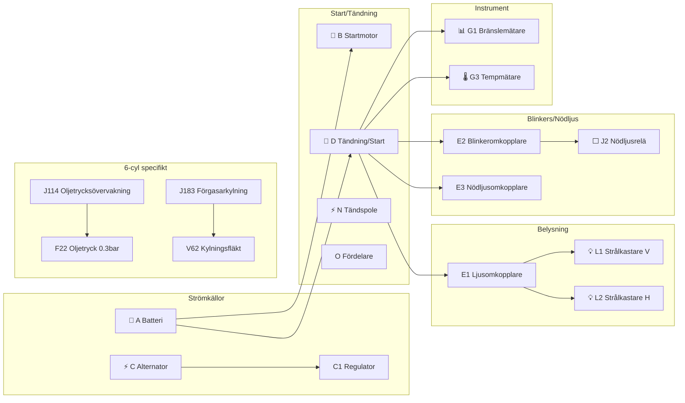

# Nyckel till Fig 13.78 – Huvudströmflödesdiagram, 6-cylinder, 1983–1985

**Källa:** VW LT Workshop Manual 1976–1987, sid 273

## Komponentförteckning

| Bet. | Beskrivning | Strömspår |
|------|-------------|-----------|
| A | Batteri | 4 |
| B | Startmotor | 5, 6 |
| C | Alternator (enbart diesel) | 2, 3 |
| C1 | Spänningsregulator | 2, 3 |
| D | Tändning/startomkopplare | 8–10 |
| E1 | Ljusomkopplare | 60–63 |
| E2 | Blinkeromkopplare | 44 |
| E3 | Nödljusomkopplare | 40–47 |
| E4 | Helljusdimmer/blinkeromkopplare | 69, 70 |
| E9 | Friskluftsfläktomkopplare | 72, 73 |
| E15 | Bakruteuppvärmningsomkopplare | 37–39 |
| E20 | Instrument/instrumentpanelbelysning | 64 |
| E22 | Intermittent torkaromkopplare | 84–87 |
| F | Bromsljusomkopplare | 53, 54 |
| F1 | Oljetrycksomkopplare (1.8 bar) | 42 |
| F2 | Dörrkontaktomkopplare, vänster fram | 95 |
| F4 | Backljusomkopplare | 69 |
| F7 | Dörrkontaktomkopplare, bakre skjutdörr | 92 |
| F9 | Handbromsvarningsomkopplare | 40 |
| F11 | Bakdörrkontaktomkopplare | 93 |
| F22 | Oljetrycksomkopplare (0.3 bar) | 41 |
| F26 | Termobrytare för automatisk choke, framre insugsgrenrör | |
| F34 | Bromsvätska nivåvarningskontakt | 39 |
| F35 | Termobrytare för insugsgrenrör förvärmning | 16 |
| F66 | Kylvätskenivå indikatoromkopplare | 23 |
| F112 | Termobrytare för förgasarkylningsfläkt | |
| G | Bränslemätare sändare | 25 |
| G1 | Bränslemätare | 28 |
| G2 | Kylvätsketemperatur sändare | 24 |
| G3 | Kylvätsketemperaturmätare | 29 |
| G6 | Elektrisk bränslepump | 26 |
| H | Tuta platta | 44 |
| H1 | Tuta | 43 |
| J2 | Nödljusrelä | 53, 54 |
| J6 | Spänningsstabilisator | 28 |
| J31 | Intermittent tork/spol-relä | 82, 86 |
| J59 | Avlastningsrelä (för X-kontakt) | 74, 75 |
| J81 | Insugsgrenrör förvärmningsrelä, på hjälpreläadapter | 15, 16 |
| J114 | Oljetrycksövervakningsenhet | 33, 34 |
| J120 | Kylvätska/kylvätskenivå indikator, på hjälpreläadapter | 22, 23 |
| J183 | Relä för förgasarkylningsfläkt (tidrelä) | 20, 21 |
| K1 | Helljusvarningslampa | 78 |
| K2 | Generatorvarningslampa | 31 |
| K3 | Oljetrycksvarningslampa | 35 |
| K5 | Blinkervarningslampa | 32 |
| K6 | Nödljussystem varningslampa | 58 |
| K7 | Dubbelkretsbromsar och handbroms varningslampa | 39 |
| K10 | Bakruteuppvärmning varningslampa | 48 |
| K28 | Kylvätsketemperatur/kylvätska varningslampa | |
| L1 | Dubbelfilament strålkastare, vänster | 88, 90 |
| L2 | Dubbelfilament strålkastare, höger | 89, 91 |
| L9 | Ljusomkopplare ljusglödlampa | 74 |
| L10 | Instrumentpanelinsats glödlampa | 36–38 |
| L16 | Friskluftreglage glödlampa | 70 |
| L28 | Cigarettändare glödlampa | 50 |
| L39 | Bakruteuppvärmning omkopplarglödlampa | 47 |
| M1 | Sidoljus, vänster | 83 |
| M2 | Bakljus, höger | 84 |
| M3 | Sidoljus, höger | 85 |
| M4 | Bakljus, vänster | 82 |
| M5 | Blinker fram vänster | 61 |
| M6 | Blinker bak vänster | 62 |
| M7 | Blinker fram höger | 63 |
| M8 | Blinker bak höger | 64 |
| M9 | Bromsljus, vänster | 67 |
| M10 | Bromsljus, höger | 66 |
| M16 | Backljus, vänster | 69 |
| M17 | Backljus, höger | 68 |
| N | Tändspole | 8 |
| N1 | Automatisk choke | 18 |
| N3 | Bypass luftavstängningsventil | 26 |
| N6 | Seriemotstånd | 7 |
| N23 | Seriemotstånd för friskluftsfläkt | 72 |
| N36 | Seriemotstånd för automatisk choke | 18 |
| N51 | Värmeelement för insugsgrenrör förvärmning | 15 |
| O | Fördelare | 9–13 |
| P | Tändstiftskontakt | 9–13 |
| Q | Tändstift | 9–13 |
| R | Radioanslutning | 49, 51 |
| S1–S15 | Säkringar i säkringsdosa | |
| S50 | Säkring, terminal 58b, 10A, på hjälpreläadapter | 80 |
| S51 | Säkring för förgasarkylningsfläkt | 20 |
| T1 | Koppling, enkel, i motorrum | |
| T1a | Koppling, enkel, bakom reläplatta | |
| T1b | Koppling, enkel, bakom reläplatta | |
| T1c | Koppling, enkel, i bakdörr | |
| T1g | Koppling, enkel, nära förgasare | |
| T1h | Koppling, enkel, nära förgasare | |
| T1i | Koppling, enkel, bakom instrumentpanel | |
| T2 | Koppling, 2-pin, bakom reläplatta | |
| T2a | Koppling, 2-pin, bakom instrumentpanel | |
| T2b | Koppling, 2-pin, bakom instrumentpanel | |
| T2c | Koppling, 2-pin, bakom instrumentpanel | |
| T4 | Koppling, 4-pin, bakom instrumentpanel | |
| T4a | Koppling, 4-pin, bakom instrumentpanel | |
| T8/ | Koppling, 8-pin, på instrumentpanelinsats | |
| T14/ | Koppling, 14-pin, på instrumentpanelinsats★ | |
| U1 | Cigarettändare | 51 |
| V | Vindrutetorkarmotor | 97, 98 |
| V2 | Friskluftsfläkt | 73 |
| V5 | Vindrutespolarpump | 103 |
| V62 | Förgasarkylningsfläkt, motor, vänster | 20 |
| W | Kupébelysning, fram | 95, 96 |
| W1 | Kupébelysning, bak/lastfack | 93, 94 |
| X | Nummerskyltsbelysning | 82 |
| Y | Klocka | 36 |
| Z1 | Bakruteuppvärmning | 45 |

★ Kontakterna i T14-kontaktdonet avser instrumentpanelinsatsens kretskort, **inte** kabelhärvans kontaktdon.

## Jordpunkter

| Nr | Plats |
|----|-------|
| 1 | Jordband, batteri – kaross |
| 3 | Jordband, motor – kaross |
| 15 | Jordpunkt på cylinderlock |
| 23 | Jordkabel ovanför styrväxel |
| 30 | Jordpunkt intill reläplatta |
| 31 | Jordpunkt på instrumentpanelinsats |
| 33 | Jordpunkt bakom instrumentpanel, höger |
| 65 | Jordpunkt på vänster längsgående balk, bak |
| 68 | Jordpunkt på bakre tvärbalk, vänster |
| 69 | Jordpunkt på bakre tvärbalk, höger |
| 71 | Jordpunkt på takrail, fram |
| 72 | Jordpunkt på takrail |
| 79 | Jordpunkt nära kupébelysning, bak |

## Övergripande kretsöversikt

